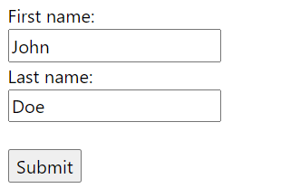
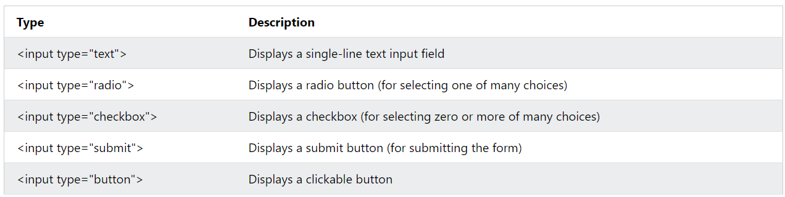

# Forms
- Is used to collect user input.
- user input is most often sent to a server for processing.


### `<form>`
- form element is used to create an HTML from for user input.

```html
<form>

</form>
```

- form element is a container for dif type of input elements.
> **Note:** text fielid, checkboxes, radio buttons, submit buttons.     

### `<input>`
- most used form elements.
- can be display in many ways, depending upon `type` attribute.


#### text field
- defines a single line input field for text input.

```html
<form>
  <label for="fname">First name:</label><br>
  <input type="text" id="fname" name="fname"><br>
  <label for="lname">Last name:</label><br>
  <input type="text" id="lname" name="lname">
</form>
```

### `<label>`
- defines a label for many form elements.
- useful for screen-reader users ,read then input when they click on input hightlight the label.
- also helps users who have difficullty clicking on very small ragions.
- for attribute of lable tag should equals to id attribute of input to bind them together.