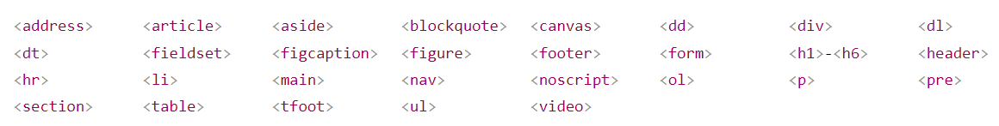
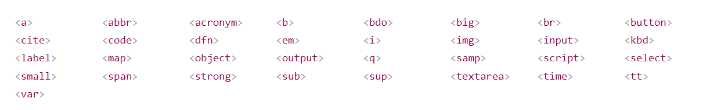

# Block and Inline Element
- every element has a default diplay value.

## Types

### Block-level
- Always start on a new line and takes up full width availble (as far as it can).
- Browsers auto add some space(margin).  
**example**  
1. `<p>`
2. `<div>`

#### div
- often used as container for other elements.
- no req attribure but class, id, style are comman.
- can be used to style a block of content.

```html
<div style="background-color:black;color:white;padding:20px;">

  <h2>London</h2>

  <p>London is the capital city of England. It is the most populous city in the United Kingdom, with a metropolitan area of over 13 million inhabitants.</p>

</div>
```

##### Some more example:


### Inline Element
- does't start with new line.
- takes up as much width as necessary.  
**Example**  
1. `<span>`  


> **Note:** can't contain block-level element.


