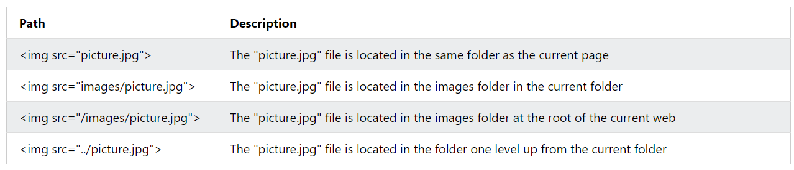

# File Path
- describes the location of file in a web sites's folder structure.


- used when linking to external files, like
    - web pages 
    - images
    - style sheets
    - javaScript

## Types

### Absolute File Path
- Is a full url to a file.
```html

```

### Relative File paths
- points to a file relative to the current page.

```html


```

> **Note:** always use relative if possible.  

> **Note:** When using relative file paths, your web pages will not be bound to your current base URL. All links will work on your own computer (localhost) as well as on your current public domain and your future public domains.